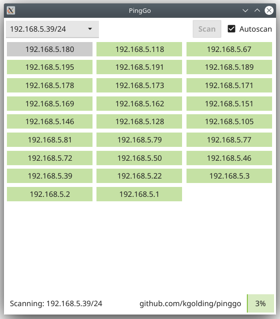

# PingGo

> A fast very angry ping scanner that shows recently added/removed IP addresses

Built with go and Fyne so should work on MAC, Windows and Linux (it requires the `ping` command line tool).

## How to build

1. `git clone https://github.com/kgolding/pinggo`
1. `cd pinggo`
1. `go mod tidy`
1. `go run *.go`

